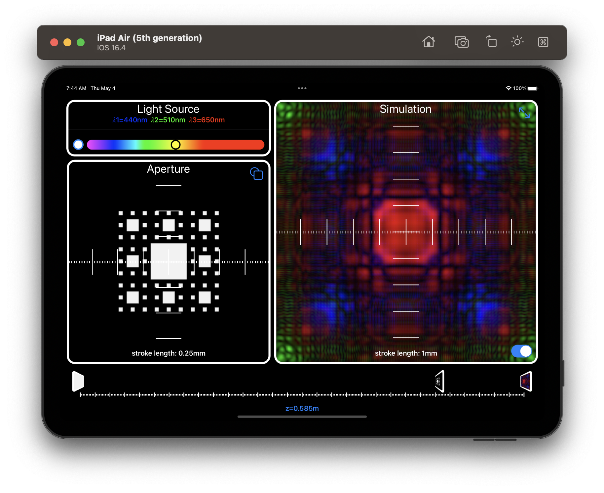
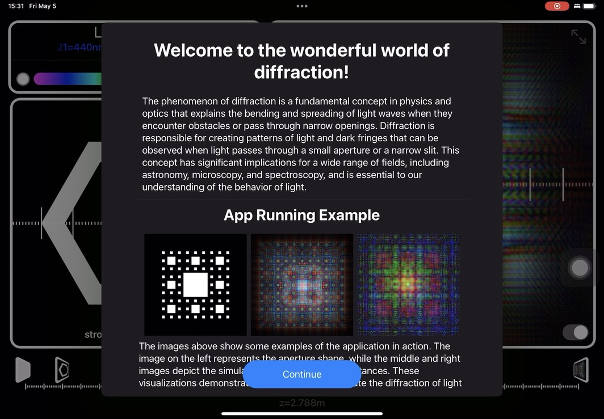

# LightPlayground

Simulate Diffraction Pattern of compound light over arbitrary shape aperture. The calculating is based an Angular Spectrum method and implemented using 2DFFT to make real time interaction possible.

With this app, you can simulate a variety of aperture shapes, select different light sources with varying wavelengths, adjust the distance between the aperture and the simulation panel, and view the simulation results **in real-time**.



My first project with above 2k lines in swift. And it's only when my lines grows at a scale, I realized that my code sucks.

This project is in fact of reimplementation of [diffractsim: A flexible python diffraction simulator](https://github.com/rafael-fuente/diffractsim) in swift. My implementation add live view ability that enable's you to view 

## Diffraction
Please refer to this wiki page for more information about Diffraction [wiki](https://en.wikipedia.org/wiki/Diffraction)

## Mathemetics
Instead of using direct integration, I use 2DFFT method in this app. For more information, see this paper [Efficient full-path optical calculation of scalar and vector diffraction using the Bluestein method](https://www.nature.com/articles/s41377-020-00362-z). The the author of [diffractisim](https://github.com/rafael-fuente/diffractsim) has serval great [blogs](https://rafael-fuente.github.io) explaining this with python implementation code and video.

### Colors
See [CIE1931 XYZ color space] for color transformation, also included in the [blogs](https://rafael-fuente.github.io). However, I found system default sRGB and genericXYZ color space works weird on mac, so instead of using system default colorspace transformation, I used a handmade wavelength and sRGB color functionn. The mixtures white color wasn't infact implemented in this paper, as I thought it won't fit real time response. Instead I use $440nm$, $510nm$, $650nm$ as RGB channels, diffract them independently and draw the picture with intensity of those three light as RGB channel values. It works with some basic assumptions that R,G,B light's wavelength distribution or XZY channel relative value don't change with it's intensity, which I though are unlikly to be truth. We can't simply add RGB values for light composition, we need to transform to XYZ colorspace to do some operation. But if we find $\lambda_r$, $\lambda_g$, $\lambda_b$ each corresponds to R, G, B in RGB colorspace, things would be much easier. We use $l_1$, $l_2$ $l_3$ to denote intensity for light of wavelength $\lambda_r$, $\lambda_g$, $\lambda_b$. We have

$$
\begin{bmatrix}
a \\
b \\
c \\
\end{bmatrix}
= A
\begin{bmatrix}
a \\
b \\
c \\
\end{bmatrix} 
= \begin{bmatrix}
X \\
Y \\
Z \\
\end{bmatrix}
= B 
\begin{bmatrix}
l_1 \\
l_2 \\
l_3 \\
\end{bmatrix}
$$

thus 

$$
\begin{bmatrix}
r \\ g \\ b \\
\end{bmatrix}
= A^{-1} B 
\begin{bmatrix}
l_1 \\ l_2 \\ l_3 \\
\end{bmatrix}
$$

with assumptions above, we have

$$
\begin{aligned}
\begin{bmatrix}
1 \\ 0 \\ 0 \\
\end{bmatrix}
= A^{-1} B 
\begin{bmatrix}
1 \\ 0 \\  0 \\
\end{bmatrix} \\
\begin{bmatrix}
0 \\ 1 \\ 0 \\
\end{bmatrix}
= A^{-1} B 
\begin{bmatrix}
0 \\ 1 \\  0 \\
\end{bmatrix} \\
\begin{bmatrix}
0 \\ 0 \\ 1 \\
\end{bmatrix}
= A^{-1} B 
\begin{bmatrix}
0 \\ 0 \\  1 \\
\end{bmatrix} \\
\end{aligned}
$$

thus we have

$$
\begin{aligned}
& A^{-1} B = \begin{bmatrix}
1 & 0 & 0 \\
0 & 1 & 0  \\
0 & 0 & 1 \\
\end{bmatrix}  \\
& \begin{bmatrix}
r \\ g \\ b \\
\end{bmatrix}  = 
\begin{bmatrix}
l_1 \\ l_2 \\ l_3 \\
\end{bmatrix}
\end{aligned}
$$


### The Angular Spectrum
It greatly simplify the calculatation, and were more flexible than direct 2DFFT. The problems that, after it use 2DFFT to calculate Angular Spectrum, it infact calcuate Angular Spectrum at a fixed finite space, and after times it with coefficient and do inverse transformation, there's no grantee on the result's error. I'm wondering if there's theory like Nyquist–Shannon sampling theorem on this problem. 

I figure the result could achieve higher precision was operations like down sampling and interporation, however not yet implementated here.

## Swift
At the time I write this application, I have little experience in Manual management in swift. When working with `Accelerate` Framework, I found it's vary common using Pointer's there. I recommend you read [Swift Standard Library](https://developer.apple.com/documentation/swift/manual-memory-management) on this topic. Anyway, I didn't pay much attention to this line

    > When you call a function that is declared as taking an UnsafePointer<Type> argument, you can pass any of the following:
    - A [Type] value, which is passed as a pointer to the start of the array.
    
    > When you call a function that is declared as taking an UnsafeMutablePointer<Type> argument, you can pass any of the following:
    An in-out expression of type [Type] that contains a mutable variable, property, or subscript reference, which is passed as a pointer to the start of the array, and is lifetime-extended for the duration of the call.
    
Thus I wrote those augly code:
```swift
public class LTArray2D<T>: AccelerateMutableBuffer {
    
    public func withUnsafeMutableBufferPointer<R>(_ body: (inout UnsafeMutableBufferPointer<T>) throws -> R) rethrows -> R {
        var unsafeMutableBufferPointer = UnsafeMutableBufferPointer(start: data, count: count)
        return try body(&unsafeMutableBufferPointer)
    }
    
    public func withUnsafeBufferPointer<R>(_ body: (UnsafeBufferPointer<T>) throws -> R) rethrows -> R {
        return try body(UnsafeBufferPointer(start: data, count: count))
    }
    
    public typealias Element = T
    
    var data: UnsafeMutablePointer<T>
    
    deinit {
        data.deallocate()
    }
    
    public var width: Int
    public var height: Int
    public var count: Int { width * height }
}
```

beside, I found this memory manage paradiam preveal in Accelerate Framework documentation:
```swift
Buffer.withUnsafeBufferPointer { buffer in
    ...
}
```
### Matrix
Still, Matrix operation support is not as fulledged as in c++ or numpy-like wrapper in python. You can use Accelarate Framework on Apple platforms, which is a good solution. I'm think about write a cross platform Matrix Operation Interface that take use of `Accelerate Framework` on Apple Frameworks and `OpenBlas` elsewhere. 

    

